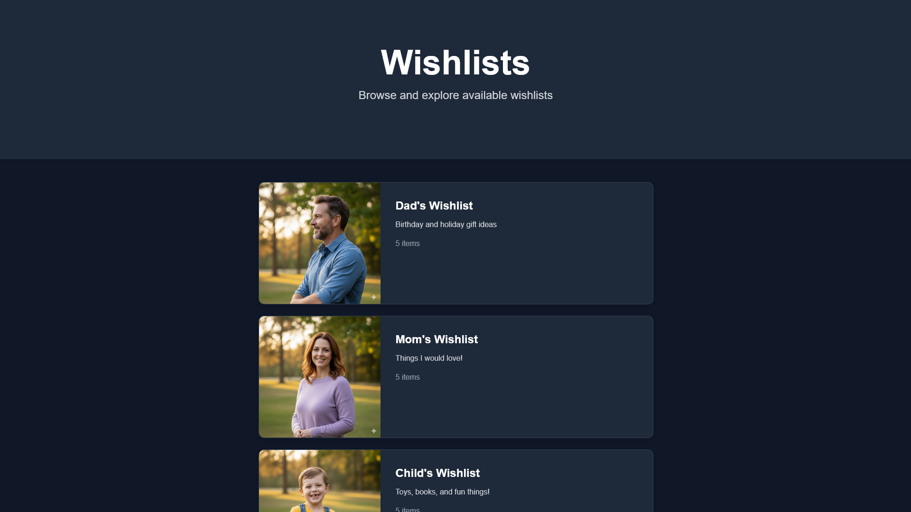
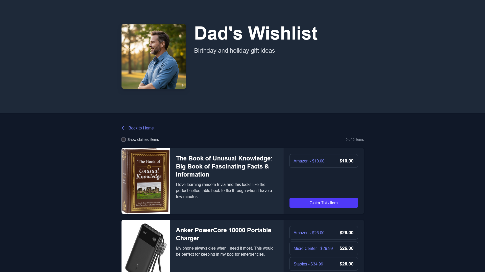
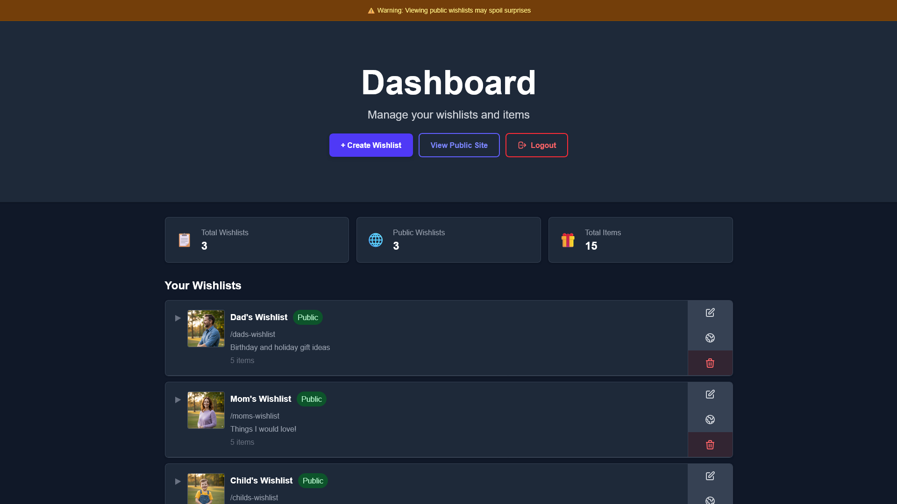
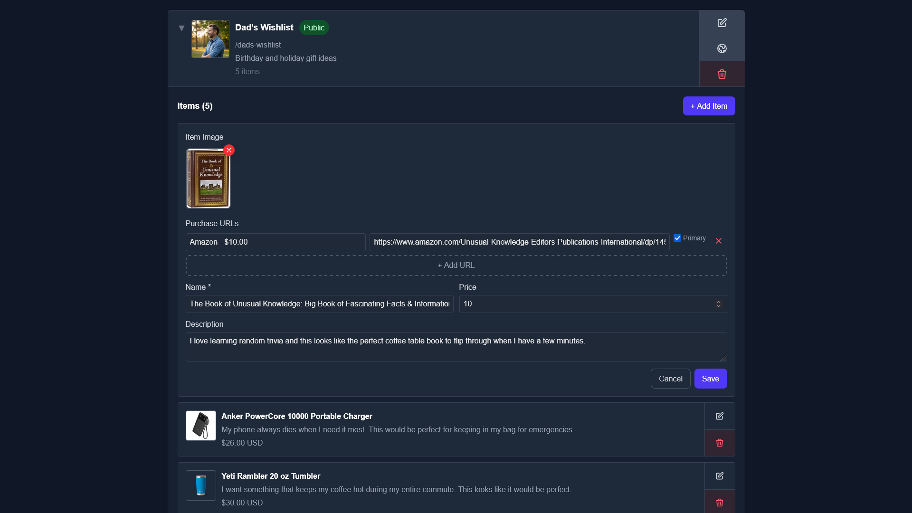

# Wishlist

[](https://hub.docker.com/r/reggiodigital/wishlist)
[](https://github.com/Reggio-Digital/wishlist/blob/main/LICENSE)

A simple, self-hosted wishlist app for sharing gift ideas with family and friends.

## Why This App?

Most wishlist apps are bloated with features you don't need, require accounts for everyone, or lock you into a platform. This app solves a simple problem: you want to share what you'd like as gifts, and your friends and family want to claim items without spoiling the surprise.

**Features:**

- **Simple** - No complex features, just wishlists and items
- **Easy to Share** - Send a single URL, no signups required
- **Multiple Purchase Links** - Add multiple store links for each item so people can choose where to buy
- **Public/Private Wishlists** - Keep lists private while you're working on them, then make them public when ready
- **No Peeking!** - Admins can't see claimed items from the dashboard - you'd have to visit the specific wishlist's public URL to spoil the surprise
- **Privacy-Focused** - Self-hosted, your data stays with you
- **Transparent** - Anyone viewing the list can see what's been claimed to avoid duplicates
- **Low Maintenance** - Single Docker container with SQLite, no database setup needed
- **URL Scraping** - Auto-fill item details from product URLs _(Coming Soon)_

## Demo


## Screenshots

### Homepage



### Wishlist View



### Admin Dashboard



### Admin Dashboard - Item Details



## Quick Start

### Using Docker Compose

```bash
# Clone and configure
git clone https://github.com/Reggio-Digital/wishlist
cd wishlist
cp .env.example .env

# Edit .env with your admin credentials
nano .env

# Start with Docker Compose
docker-compose up -d
```

Visit http://localhost:3000

### Using Docker Image

```bash
docker run -d \
  -p 3000:3000 \
  -e ADMIN_USERNAME=admin \
  -e ADMIN_PASSWORD=your-secure-password \
  -v wishlist-data:/app/data \
  --name wishlist \
  reggiodigital/wishlist:latest
```

## Data Storage

Data is stored in `/app/data`:

- `/app/data/db` - SQLite database files
- `/app/data/uploads` - Uploaded images

## Environment Variables

Create a `.env` file:

```env
# Required - Admin Credentials
ADMIN_USERNAME=admin
ADMIN_PASSWORD=changeme

# Optional - JWT Secret (auto-generated if not provided)
# Generate with: openssl rand -base64 32
SECRET=
```

## Development

```bash
# Install dependencies
npm install

# Run development server
npm run dev

# Build for production
npm run build

# Start production server
npm start
```

## Pages

- `/admin/login` - Admin authentication
- `/admin` - Admin dashboard (manage wishlists and items)
- `/[slug]` - Public wishlist view

## License

MIT

---

Made with ❤️ by [Reggio Digital](https://reggiodigital.com)
